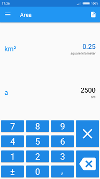
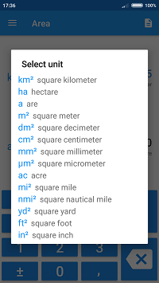
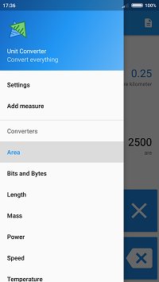
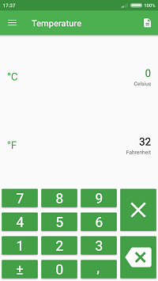
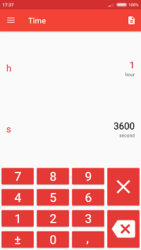
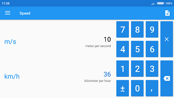

#  Unit Converter

You can get this app from [Google Play](https://play.google.com/store/apps/details?id=pro.adamzielonka.converter).

## Measure File Format

To add custom measures you can use editor build in app or you can prepare the json file:

``` json
{
  "name": {
    "en": "Area",
    "pl": "Powierzchnia"
  },
  "version": 1,
  "author": [
    "root"
  ],
  "global": "en",
  "units": [
    {
      "symbol": "m²",
      "descriptionPrefix": {
        "en": "square ",
        "pl": ""
      },
      "description": {
        "en": "meter",
        "pl": "metr kwadratowy"
      },
      "one": 1,
      "prefixes": [
        {
          "symbol": "k",
          "description": {
            "en": "kilo"
          },
          "exp": 6,
          "position": 3
        },
        {
          "symbol": "d",
          "description": {
            "en": "deci",
            "pl": "decy"
          },
          "exp": -2
        },
        {
          "symbol": "c",
          "description": {
            "en": "centi",
            "pl": "centy"
          },
          "": -4
        },
      ]
    },
    {
      "symbol": "in²",
      "description": {
        "en": "square inch",
        "pl": "cal kwadratowy"
      },
      "one": 0.00064516
    }
  ]
}

```
You can find more measures files on this folder: [./app/src/main/assets/converters](./app/src/main/assets/converters)

### Properties
|property|value|
|---|-----|
|file|`{name, version, author, global, units}`|
|||
|`name`|`{"country_code" : "`measure name`"}`|
|`version`|integer|
|`author`|`["`author name`"]`|
|`global`|base country code name|
|`units`|`[{symbol, descriptionPrefix, description, one, shift, shift2, expBase, prefixes}]`|
|||
|`symbol`|base unit symbol|
|`descriptionPrefix`|`{"country_code" : "`description prefix`"}`|
|`description`|`{"country_code" : "`description`"}`|
|`one`|number of multiples of base unit, default is `1`|
|`shift`|number of shift to the basic unit, default is `0`|
|`shift2`|number of shift to the basic unit, default is `0`|
|`expBase`|exponent base for prefixes, default is `10`|
|`prefixes`|`[{symbol, description, exp}]`|
|||
|`symbol`|prefix symbol|
|`description`|`{"country_code" : "`prefix description`"}`|
|`exp`|prefix exponent|

### Equations

In the file you define paramiters for the equation that caluclate target unit value from base unit:
```math
y = \alpha*(x + \Delta_1) + \Delta_2
```

where: 

*  $`x`$ - value of base unit
*  $`y`$ - value of target unit
*  $`\alpha`$ - `one` - multiply of base value
*  $`\Delta_1`$ - `shift_1` - shift base value before multiply
*  $`\Delta_2`$ - `shift_2` - shift base value after multiply

For calculate base unit value form target unit, the equation is:

```math
x = \frac{1}{\alpha}*(y - \Delta_2) - \Delta_1
```

To calculate from one unit to another, it used this formula:

```math
f(x) = \frac{1}{\alpha^T}*(\alpha^S*(x + \Delta_1^S) + \Delta_2^S - \Delta_2^T) - \Delta_1^T
```

where: 

*  $`x`$ - value of source unit
*  $`f(x)`$ - value of target unit
*  $`\alpha^S`$ - `one` from source unit
*  $`\Delta_1^S`$ - `shift_1` from source unit
*  $`\Delta_2^S`$ - `shift_2` from source unit
*  $`\alpha^T`$ - `one` from target unit
*  $`\Delta_1^T`$ - `shift_1` from target unit
*  $`\Delta_2^T`$ - `shift_2` from target unit


## Screens








## License
MIT
